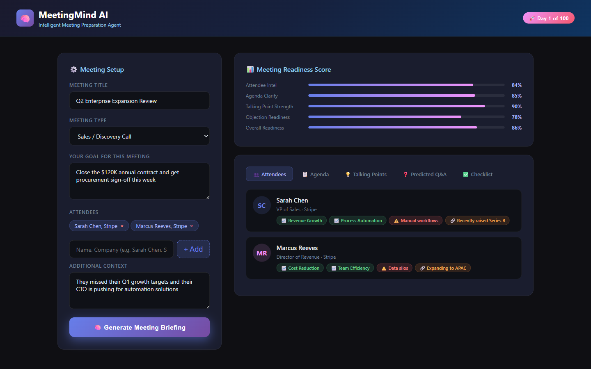

# 🧠 MeetingMind AI

> **Day 1 of 100 | 100 Days, 100 AI Agents — Building the Future in Public**  
> An autonomous AI agent for intelligent meeting preparation.



MeetingMind AI helps sales executives, founders, and deal-makers walk into any meeting fully prepared. Given a meeting title, type, goal, and attendee information, it autonomously generates personalized briefings using Grok AI.

## 🚀 Live Demo

**[Try it now →](https://meetingmind-ai-nine.vercel.app/)**

## ✨ Features

- **👥 Attendee Profiles** — Psychological & professional profiles with interests, pain points, and conversation hooks
- **📋 Strategic Agenda** — Time-boxed agenda optimized for your meeting goal  
- **💡 Talking Points** — Specific phrases and tactics (not generic advice)
- **❓ Predicted Q&A** — The 5 hardest questions + battle-tested answers
- **✅ Pre-Meeting Checklist** — Prioritized actions with time estimates
- **📊 Readiness Score** — Calculated score (0-100) based on preparation completeness


## 📁 Project Structure

```
meetingmind-ai/
├── api/
│   └── briefing.js          # Vercel serverless API endpoint (Node.js + Grok AI)
├── demo.html                # Interactive browser demo
├── index.html               # Entry point for Vercel
├── package.json             # Node.js dependencies
├── meetingmind-results.png  # Screenshot for README
├── startup-one-pager.md     # Business model & strategy
├── linkedin-post.md         # Marketing content
└── AGENTS.md                # Agent documentation
```

## 🛠️ Tech Stack

- **Backend:** Node.js + Grok AI (xAI)
- **Frontend:** Vanilla HTML/CSS/JS
- **Hosting:** Vercel (Serverless)
- **AI API:** OpenAI-compatible Grok API

## 🔧 Setup & Development

### 1. Clone & Install

```bash
git clone https://github.com/sathishlella/meetingmind-ai.git
cd meetingmind-ai
npm install
```

### 2. Configure Environment

Create a `.env` file:
```
XAI_API_KEY=your_grok_api_key_here
```

Get your free Grok API key from: https://console.x.ai

### 3. Run Locally

```bash
# Install Vercel CLI
npm i -g vercel

# Run dev server
vercel dev
```

Open http://localhost:3000

## ☁️ Deploy to Vercel

### Quick Deploy

1. **Go to** [vercel.com](https://vercel.com) → Sign in with GitHub
2. **Click** "Add New Project"
3. **Import** `sathishlella/meetingmind-ai`
4. **Add Environment Variable:**
   - Name: `XAI_API_KEY`
   - Value: Your Grok API key
5. **Click Deploy**

### CLI Deploy

```bash
npm i -g vercel
vercel
# Add env var
vercel env add XAI_API_KEY
vercel --prod
```

## 📝 Environment Variables

| Variable | Required | Description |
|----------|----------|-------------|
| `XAI_API_KEY` | ✅ Yes | Your Grok (xAI) API key |

## 🎯 How It Works

1. **Input:** Meeting details (title, type, goal, attendees)
2. **AI Processing:** Grok AI analyzes and generates:
   - Attendee psych profiles
   - Strategic agenda
   - Talking points & predicted Q&A
   - Action checklist
3. **Output:** Complete meeting briefing with readiness score

## 💼 Business Model

| Plan | Price | Features |
|------|-------|----------|
| Starter | $29/mo | 30 briefings/month |
| Pro | $79/mo | Unlimited, CRM sync |
| Team | $199/mo | Shared playbooks |
| Enterprise | Custom | SSO, API, dedicated CSM |

## 🎯 Target Market

- **B2B Sales Reps** (5.7M in US)
- **Startup Founders & CEOs** (600K in US)  
- **VC/PE Investors** (80K in US)

## 🏆 About the Challenge

This project is part of **"100 Days, 100 AI Agents — Building the Future in Public"**

I'm building 100 AI agents in 100 days, sharing the journey openly. Each day = one AI agent startup. Follow along!

**Day 1:** MeetingMind AI — Meeting preparation agent

## 🔗 Links

- 🌐 **Live Demo:** https://meetingmind-ai-nine.vercel.app/
- 💻 **GitHub:** https://github.com/sathishlella/meetingmind-ai
- 🐦 **Twitter/X:** *(Add your handle)*
- 💼 **LinkedIn:** *(Add your profile)*

## 🤝 Contributing

This is an open journey! Feel free to:
- ⭐ Star the repo
- 🐛 Report issues
- 💡 Suggest features
- 🔀 Submit PRs

## 📄 License

MIT License — feel free to use and modify.

---

**Built by:** Sathish Lella  
**Challenge:** 100 Days, 100 AI Agents — Building the Future in Public  
**Day:** 1 of 100 🚀
